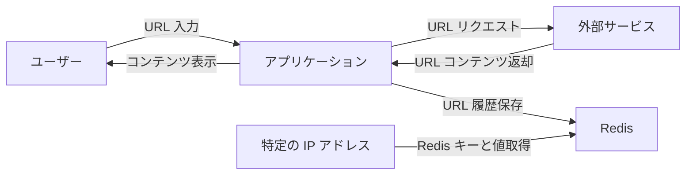
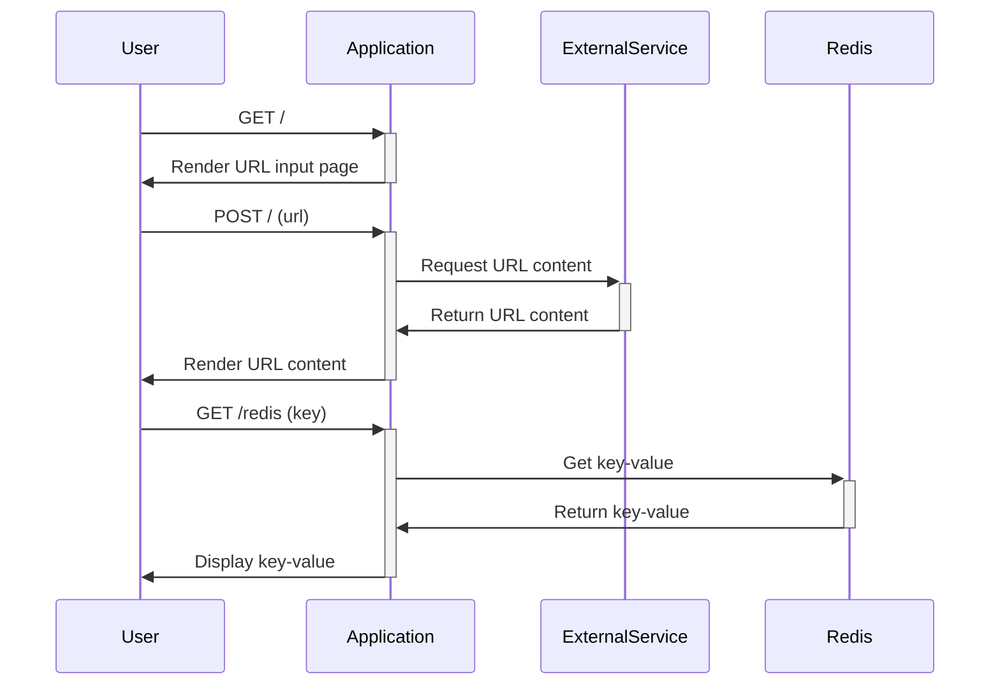
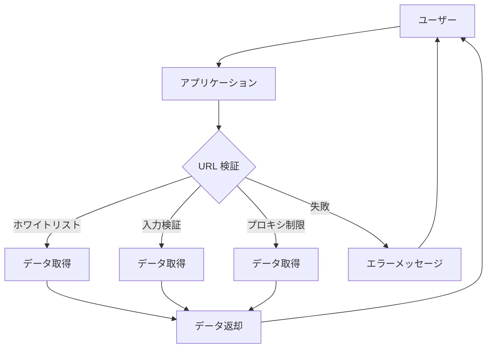

## Server Side Request Forgery (SSRF)

Server Side Request Forgery (SSRF)は、攻撃者が外部システムに対してサーバーを利用して不正なリクエストを送信することができる脆弱性です。

### 原因と影響

SSRF は、アプリケーションが信頼されていない URL からデータを取得する機能が存在し、その機能に対する入力検証が不十分である場合に発生します。攻撃者は、SSRF を利用してプライベートネットワークへのアクセス、クラウドサービスのメタデータの漏洩、他のサービスへの攻撃の拡大などを行うことができます。

## 実践

### アプリケーションの概要

WebProxy4B という名前で、ユーザーが入力した URL の内容を取得して表示する機能を提供しています。しかし、このアプリケーションには SSRF の脆弱性が存在しており、攻撃者が不正なリクエストを送信することができます。
また、今回は初期化時に `redis` にフラグを読み込ませており、このフラグを取得するとを目標とします。

```text
Flaskを使用したWebアプリケーション
ユーザーが入力したURLの内容を取得し、表示する機能がある
Redisを使用してURLの履歴を保存している
特定のIPアドレスからのリクエストのみ、Redisのキーと値を取得できる機能がある
```



- API flow



- URL として`https://example.com`を指定する

  - PyCurl(libcurl の Python バインディング)を使用し、ユーザからの入力パラメータを受け取り、レスポンスを取得する（プロキシのような機能）

- 脆弱性の特定

  - このアプリケーションでは、`route_index_post` 関数でユーザーから入力された URL をそのまま使用して、外部サービスにリクエストを送信している。
  - `route_redis`関数を経由して redis 内のアクセスができそう

- コンテナ内の`http://127.0.0.1:5000/redis`API に対して、ローカルサーバからアクセスをすると攻撃が通る
  - http://127.0.0.1:5000/redis?key=FLAG

```python
app.route("/redis", methods=["GET"])
def route_redis():

    if request.remote_addr != "127.0.0.1":
        return "Forbidden :(", 403

    key = request.args.get("key")
    if key == "" or key == None:
        return "key must be specified"

    if redis.exists(key) == False:
        return "key not found"

    t = redis.type(key)

    if t == b"string":
        value = redis.get(key)
    elif t == b"list":
        value = "\n".join([i.decode() for i in redis.lrange(key, 0, -1)])
    else:
        value = "the type of the value is neither string or list :("

    return value
```

### 対策

SSRF 対策として以下の方法があります。

- URL のホワイトリスト化
- ユーザーからの入力に対する適切な検証
- プロキシを通じて外部リクエストを制限



### 事例紹介

- GitHub Enterprise で SSRF を経由したオブジェクトインジェクションの事例[link](https://blog.orange.tw/2017/07/how-i-chained-4-vulnerabilities-on.html)

1. First bug - SSRF-Bypass on Webhooks

概要:
GitHub Enterprise の Webhooks における SSRF(Server Side Request Forgery)のバイパスです。Webhook の URL 検証を回避し、内部サービスに対するリクエストを行うことができます。

2. Second bug - SSRF in internal Graphite service

概要:
GitHub Enterprise の内部 Graphite サービスにおける SSRF の脆弱性です。攻撃者はこの脆弱性を利用して、内部サービスへのリクエストを送信し、情報を取得することができます。

3. Third bug - CR-LF Injection in Graphite

概要:
Graphite サービスにおいて、CR-LF(キャリッジリターン・ラインフィード)インジェクションの脆弱性が存在します。これにより、攻撃者は不正なデータを Graphite に挿入し、意図しない結果を引き起こすことができます。

4. Fourth bug - Unsafe Marshal in Memcached gem

概要:
Memcached gem において、安全でない Marshal 機能の使用による脆弱性があります。攻撃者は、この脆弱性を利用して、任意の Ruby コードを実行することができます。

これらのバグは、それぞれ組み合わせることで、GitHub Enterprise に対するリモートコード実行(RCE)攻撃が可能となります。

| 用語              | 説明                                                                                                                |
| ----------------- | ------------------------------------------------------------------------------------------------------------------- |
| Graphite サービス | オープンソースのモニタリングツールで、時系列データの収集、保存、可視化を行います。                                  |
| CR-LF             | CR（キャリッジリターン、ASCII コード：0x0D）と LF（ラインフィード、ASCII コード：0x0A）の略で、改行文字の一種です。 |
| Memcached gem     | Ruby プログラムで Memcached（分散キャッシュシステム）と通信するためのライブラリです。                               |
| Marshal 機能      | Ruby のシリアライズおよびデシリアライズ機能で、オブジェクトをバイト列に変換したり、逆に戻したりします。             |
